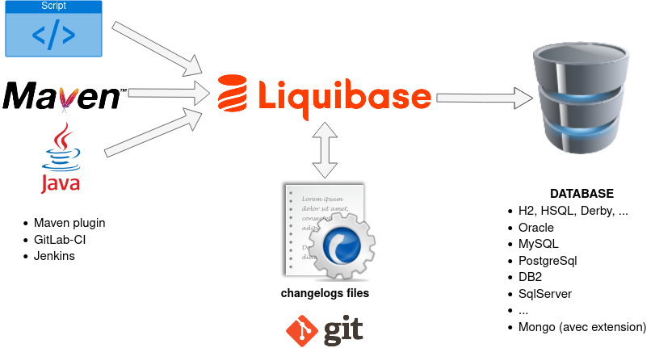

# Bonnes pratiques d'utilisation de Liquibase

> _Liquibase_ est une bibliothèque open source écrite en Java pour le suivi, la gestion et l'application des changements de schéma de base de données indépendante du SGBD. Elle a été lancé en 2006 pour faciliter le suivi des modifications de la base de données, en particulier dans un environnement de développement logiciel agile. [Wikipédia](https://fr.wikipedia.org/wiki/Liquibase)

:information_source: Le produit concurrent principal est [Flyway](https://flywaydb.org/). Les 2 produits sont par exemple nativement intégrables à des solutions telles que _Spring Boot_.

## Avantages de la solution

* **Traçabilité** :
  * historique complet des changements appliqués.
  * versioning avec le code source (et tout ce que cela implique).
* **Intégrité et cohérence** : cohérence dans l'application des changements et suivi des versions applicatives.
* **Reproductibilité :**
  * solution reproductible d'un environnement à l'autre à l'identique.
  * permet de gagner du temps et limiter les risques liés aux erreurs humaines.
* **Sécurité :**
  * mise à niveau d'un schéma, possibilité de retour à un état précédent, ...
  * automatisation : évite les erreurs humaines.
* **Indépendance technologique :**
  * indépendant de la typologie du projet ou des langages utilisés (java, .Net, ...), besoin uniquement d'une JVM pour s'exécuter (API JDBC).
  * l'outil permet d'adresser des SGBD différents avec les mêmes descripteurs (H2 pour les tests, MySQL sur le poste du développeur, Oracle en production , ...).
* **Testabilité** : possibilité d'instancier rapidement un environnement de test avec un jeu de données.

:bulb: Son utilisation est fortement conseillée et est même indispensable dans un contexte agile ou DevOps.

:bulb: Même s'il n'est pas utilisé sur les environnements cibles _Liquibase_ peut se révéler être un outil précieux pour le développeur permettant par exemple d'initialiser une base de données de développement ou de test (avec des jeux de données) en quelques secondes.

## Rappel des notions clefs

### Principe général

_Liquibase_ pilote via JDBC n'importe quelle base de données relationnelle. On peut donc l'exécuter via un script, une commande java, un programme java, une commande Maven (via un _plugin_), ...

Nous avons besoin à minima :

* de l'exécutable java (un JDK ou un JRE, 1.8 minimum depuis la version 3.7.X)
* des informations de connexions à la base de données via JDBC (par exemple dans un fichier properties ou via des arguments)
* des fichiers _changelog_ contenant les modifications à appliquer
* du jar liquibase

### Changelog

C'est le **catalogue** séquentiel des opérations à appliquer sur une base de données. Ces opérations sont organisées par lots qui doivent être définis comme les plus cohérents et consistants possibles.

### Changeset

C'est un **lot d'opérations** à appliquer sur la base de données. Ce lot pourra bien souvent se résumer à une seule opération (conseillé). Chaque lot peut être annulé via une procédure de retour arrière (_rollback_) parfois natif (pris en charge par l'outil : voir `auto-rollback`), parfois à la main du développeur (pour certaines instructions l'outil ne peut pas prédire l'action à effectuer).

### Context

Les contextes sont des **étiquettes** permettant de contrôler les changements à appliquer. Cette information peut être appliquée au niveau de l'inclusion d'un _changelog_ ou plus finement au niveau d'un _changeset_.

:bulb: Utiliser cette notion pour créer des jeux de données pour vos tests unitaires et l'intégration continue.

## Règles fondamentales

* :warning: **Ne jamais intervenir manuellement sur le schéma de base.** Toute nouvelle modification doit entraîner la création d'un nouveau _changeset_ et une mise à jour **uniquement** via _Liquibase_.
* :warning: **Un _changeset_ est IMMUABLE.** Si celui-ci a déjà été exécuté sur un des environnements projet il ne doit plus jamais être modifié dans le fichier _changelogs_. La création d'un nouveau _changeset_ corrigeant ou complétant l'ancien est obligatoire.
* :warning: **Apporter une attention particulière aux instructions de _rollback_.** Contrôler notamment via la documentation officielle le paramètre `auto-rollback` de chaque instruction utilisée. Si celui-ci est à `false` il sera obligatoire d'ajouter manuellement le comportement à appliquer via la balise `<rollback>`.

## Bonnes pratiques de conception des fichiers changelog

:bulb: On pourra préalablement prendre connaissance des recommandations du site officiel sur la [page des _Best Practices_](https://www.liquibase.org/get-started/best-practices).

### Utiliser le _workflow_ conseillé par _Liquibase_ en 5 étapes

_Liquibase_ propose un [_workflow_](https://www.liquibase.org/get-started/developer-workflow) en 5 étapes qu'il peut être bon de suivre.

**Étape 1 :** Ajouter le ou les _changesets_ dans le ou les fichiers _changelogs_

**Étape 2 :** Vérifier les instructions SQL qui seront exécutés :

* Exécuter la commande `updateSQL` pour générer le _changelog_ au format SQL.
* Contrôler visuellement ces instructions.

**Étape 3 :** _Commiter_ les modifications via l'outil de gestion de sources.

**Étape 4 :** Exécuter la commande `update` pour mettre à jour la base cible (peut être une simple base H2 de test).

**Étape 5 :** Vérifier la bonne application des changements demandés. Plusieurs possibilités (cumulables) :

* Exécuter la commande `history` pour visualiser la liste des modifications apportées.
* Exécuter la commande `status` pour vérifier la cohérence avec les _changelogs_ : aucun _changeset_ ne doit apparaître.
* Exécuter la commande `diff` par rapport à une base de référence sur laquelle les modifications n'ont pas encore été apportées.
* Contrôler visuellement le schéma de base de données et vérifier l'application des changements (ligne de commande, outil graphique, ...).

### Assurer la robustesse

* Éviter le format SQL :
  * On pert un des intérêts principal de l'outil : généricité.
  * On ne peut plus profiter des _rollbacks_ générés (_Auto Rollback_).
* Définir les changements de la manière la plus élémentaire possible (1 changement = 1 _changeset_) ainsi le code de _rollback_ est plus facile à implémenter.
* Éviter l'utilisation de `includeAll` qui permet d'inclure dans le _changelog_ principal tous les _changelogs_ d'un sous-dossier. Préférer utiliser `include` en nommant explicitement un par un les fichiers pour éviter de prendre en compte des éléments non désirés ou pour pouvoir spécifier des contextes différents.
* Positionner l'attribut `objectQuotingStrategy` sur le `databaseChangeLog` de plus au niveau (ex ⇒ `db-changelog-master.xml`). La valeur `QUOTE_ONLY_RESERVED_WORDS` est conseillée.
* Prévoir pour chaque _changeset_ son _rollback_. Se baser sur la documentation officielle car dans la majorité des cas il n'y aura rien à prévoir (vérifier dans la documentation officielle si `auto-rollback = yes`).
* Attention à certaines instructions comme `modifyDataType`, `addNotNullConstraint`, ... qui peuvent faire perdre des données (par exemple les commentaires, nullable, ...).
* Prévoir dans les _changelogs_ une compatibilité avec différents systèmes, par exemple une cible Oracle, un poste de développement avec MySQL et des tests unitaires exécutés sur une base H2 ou HSQL.
* Favoriser les _data types_ génériques _Liquibase_ (voir en annexe) et pour certains cas considérer l'utilisation de _property_ conditionnées via l'attribut `dbms` pour gérer les différents SGBD. Exemple :
  * `<property name="current.date" value="sysdate" dbms="oracle"/>`
  * `<property name="current.date" value="current_timestamp" dbms="mysql, hsqldb, h2"/>`
* Utiliser un contexte et des fichiers dédiés pour créer des jeux de tests.
* Intégrer la validation des _changelogs_ à la chaîne CI-CD :
  * A minima exécuter la commande `validate` pour valider syntaxiquement les _changelogs_.
  * Exécuter (via script ou via Maven) la commande **update** sur une base de test H2 ou HSQL.
  * Exécuter ensuite la commande **rollback**, pour tous les _changesets_ afin de vérifier que ceux-ci fonctionnent.
  * ou pour les projets Java, écrire une classe de test utilisant une base de données "_in memory_" (H2 par exemple) permettant de valider les fichiers _changelogs_, y compris le _rollback_.
  * désactiver la mise à jour automatique de schéma avec _Hibernate_ (`hbm2ddl.auto`) ou JPA 2.1 (`javax.persistence.schema-generation.database.action`).
* Limiter **au strict minimum** l'usage des `preConditions`.
  * Celles-ci sont souvent signe de _bidouilles_ voire un potentiel détournement de l'outil.
  * Celles-ci sont jouées à chaque exécution car le _changeset_ n'est jamais ajouté à la table `DATABASECHANGELOG` tant que la condition n'est pas vérifiée.

### Assurer la maintenabilité

* Organiser vos fichiers de _changelogs_ avec un fichier principal et des fichiers par version applicative comme il est indiqué dans les bonnes pratiques de l'outil (on peut également isoler les données, de test ou d'initialisation tel que des paramètres, dans un dossier dédié, par exemple _data_).
* Favoriser le format "natif" XML pour l'écriture des fichiers _changelogs_, ce format est connu de tous (dev, ops, AD), pris en charge par de nombreux outils (par exemple un simple _browser_) et ne nécessite pas de dépendances externes (fichiers jar) comme pour JSON ou Yaml (snakeyaml).
* Aligner la version des schémas XSD avec la version de Liquibase réellement utilisée. [Consulter la liste des XSD disponibles](https://www.liquibase.org/xml/ns/dbchangelog/)
* Écrire et maintenir à la main vos fichiers changelogs (s'ils sont générés la première fois il faut les revoir : modification des attributs `author` ou `id`, contrôles et ajustement des types, etc...).
* L'attribut `logicalFilePath` d'un fichier _changelog_ doit uniquement contenir le nom du fichier. Celui-ci doit également **être différent pour chaque fichier**, attention au copier-coller !
* L'attribut `author` d'un _changeset_ doit être normalisé, utiliser par exemple le nom de l'application ou du composant.
* L'attribut `id` d'un _changeset_ doit être normalisé, utiliser par exemple le numéro de version suivi d'un numéro incrémental (cet identifiant devant évidement être unique).
* Décrire clairement et synthétiquement le but d'un _changeset_ via la balise `<comment>`.
* Limiter **au strict minimum** l'usage de fichiers SQL.
  * On ne les utilisera principalement que pour de l'ajout de données techniques ou de paramétrage.
  * On les isolera dans un dossier dédié (`data` ou `sql` par exemple).
* Intégrer les _changelogs_ aux processus de revue et/ou d'audit.
* Utiliser un projet (voire même un dépôt GIT) dédié pour stocker les sources des _changelogs_ et packager celui-ci sous forme d'un module indépendant.

### Assurer l'exploitabilité

* Il est possible de changer le nom des 2 tables techniques (`DATABASECHANGELOG` et `DATABASECHANGELOGLOCK`) qu'utilise _Liquibase_. **Ne pas le faire !**
* Décorréler l'exécution de _Liquibase_ du déploiement applicatif (même si c'est très pratique). Intégrer cette exécution comme une étape indépendante du processus de mise à jour de l'application. L'analyse des problèmes n'en sera que facilité.
  * La base de données est généralement un composant critique. Le mode automatisé en "sous-marin" (_lancement automatique au déploiement de l'application_) n'est pas forcément le plus adapté (contrôle préalable et suivi, gestion des problèmes, ...).
  * Plusieurs composants ou le même composant en _cluster_ peuvent vouloir mettre à jour la base en même temps. Autant éviter des _locks_ inutiles, voir des erreurs dues à des _timeout_.
  * La base de données peut avoir besoin d'une mise à jour de façon indépendante (sans que l'on ait une _webapp_ à déployer). C'est un composant en tant que tel.
* Tagger les grandes versions applicatives.
  * Plusieurs techniques possibles : via la balise `tagDatabase` ou via la commande `tag` (voir annexe).
  * Plusieurs méthodes possibles : avant ou après les mises à jour.
* Penser à ne pas oublier et à gérer correctement les _tablespaces_. Utiliser par exemple des _property_ pour gérer l'externalisation de leurs noms qui peut varier d'un environnement à l'autre.
* Implémenter un élément (une _servlet_, un _WebService_, un _endpoint_, un _MBean_ JMX, ...) permettant de connaître l'état de la base de données (_liquibase status_).
* Exécuter toujours une commande `status` comme un _dry run_ (exécution à blanc) avant un `update` pour contrôler les mises à jour que l'outil va devoir appliquer.
* Préférer l'utilisation de la technique du [_Fixing-Forward_ plutôt que du _Rollback_](https://www.liquibase.com/blog/roll-back-database-fix-forward) :
  * moins risqué (erreurs diverses voire perte de données)
  * moins complexe
  * moins d'indisponibilité

### Assurer la sécurité

* Comme toute source il faut utiliser un système de gestion de sources (Git).
* Comme tout script aucun mot de passe ne doit apparaître en clair.
* Avec le _plugin_ Maven (généralement uniquement sur le poste du développeur) il faut positionner dans la configuration `<promptOnNonLocalDatabase>true</promptOnNonLocalDatabase>` pour alerter de la tentative de mise à jour potentielle d'une base distante.

## Annexes

### A.1 Trucs & astuces

* Pour les tests ou la validation préférer l'utilisation des bases **H2** ou **HSQL** plutôt que **Apache Derby**, cette dernière n'offrant pas de mode de compatibilité vers les SGBD phares (à positionner dans l'URL JDBC) :
  * Compatibilité vers Oracle : `sql.syntax_ora=true` pour HSQL ou `MODE=Oracle` pour H2.
  * Compatibilité vers MySQL : `sql.syntax_mys=true` pour HSQL ou `MODE=MySQL` pour H2.
* Utiliser plutôt `liquibase status --verbose` qui affiche le nom des _changesets_ à exécuter plutôt que `liquibase status` qui affiche uniquement le nombre.
* Pour faire un _rollback_ complet utiliser par exemple `liquibase rollbackToDate 1970-01-01T00:00:00`.
* Attention à l'utilisation des apostrophes dans les `remarks`. Différents comportements constatés en fonction des tags utilisés ou des SGBD cibles. Il faut parfois les doubler.<!-- Par exemple avec MySQL : -->
<!--  * `<column` pas besoin de les doubler
  * `<renameColumn` besoin de doubler
-->
* La commande `tag` et le _changeset_ `tagDatabase` ont un comportement différent :
  * Le tag créé avec la commande `tag` est ajouté sur la dernière ligne (dernier _changeset_) de la table `DATABASECHANGELOG`. Utilisable pour marquer la fin d'une version.
  * Le tag créé via l'écriture d'un  _changeset_ de type `tagDatabase`  ajoute une nouvelle ligne (donc un nouveau _changeset_) dans la table `DATABASECHANGELOG`. Utilisable pour marquer le début d'une version.

### A.2 Data types

* [Liquibase 3.6.x data types mapping table](https://dba-presents.com/index.php/liquibase/216-liquibase-3-6-x-data-types-mapping-table) | [list of available generic datatypes](https://newbedev.com/liquibase-list-of-available-generic-datatypes) | [All Liquibase types with related SQL & Java types](https://xenovation.com/blog/development/java/java-professional-developer/liquibase-related-sql-java-types)
* [Oracle 12C Data Types](https://docs.oracle.com/database/121/SQLRF/sql_elements001.htm#SQLRF30020)
* [MySQL 5.7 Data Types](https://dev.mysql.com/doc/refman/5.7/en/data-types.html)
* [PostgreSQL Data Types](https://www.postgresql.org/docs/current/datatype.html)
* [SQL Server Data Types](https://docs.microsoft.com/fr-fr/sql/t-sql/data-types/data-types-transact-sql)
* [H2 Data Types](http://h2database.com/html/datatypes.html)
* [HSQLDB Data Types](http://www.hsqldb.org/doc/guide/sqlgeneral-chapt.html#sgc_types_ops)

| Liquibase | SQL Server | Oracle | MySQL | PostgreSQL |
|-----------|------------|--------|-------|------------|
| bigint | bigint | number(38,0) | bigint | bigint/bigserial |
| blob | varbinary(max) | blob | blob | oid |
| boolean | bit | number(1) | bit | bit |
| char | char | char | char | character |
| clob | nvarchar(max) | clob | longtext | text |
| currency | money | number(15,2) | decimal | decimal |
| datetime | datetime | timestamp | timestamp | timestamp |
| date | date | date | date | date |
| decimal | decimal | decimal | decimal | decimal |
| double | float | float(24) | double | double precision |
| float | float | float | float | float |
| int | int | integer | int | integer/serial |
| mediumint | int | mediumint | mediumint | mediumint |
| nchar | nchar | nchar | nchar | nchar |
| nvarchar | nvarchar | nvarchar2 | nvarchar | varchar |
| number | numeric | number | numeric | numeric |
| smallint | smallint | number(5) | smallint | smallint/smallserial |
| time | time | date | time | time |
| timestamp | datetime | timestamp | timestamp | timestamp |
| tinyint | tinyint | number(3) | tinyint | smallint |
| uuid | uniqueidentifier | raw(16) | char(36) | uuid |
| varchar | varchar | varchar2 | varchar | varchar/character (varying) |

### A.3 Versioning Liquibase

| Version Liquibase | Version minimale Java | Dépendances obligatoires | Dépendances optionnelles | Remarques |
|-------------------|-----------------------|--------------------------|--------------------------|-----------|
| `3.5.3` | Java 6 | | snakeyaml (1.17), spring (2.0.6), servlet-api (2.4) | |
| `3.5.4` | Java 6 | | snakeyaml (1.17), spring (2.0.6), servlet-api (2.4) | |
| `3.5.5` | Java 6 | | snakeyaml (1.17), spring (2.0.6), servlet-api (2.4) | |
| `3.6.0` | Java 7 | slf4j-api (1.7.25), logback-classic (1.2.3) | snakeyaml (1.18), spring-core, spring-beans, spring-context (4.3.8.RELEASE), servlet-api (2.4) | |
| `3.6.1` | Java 7 | slf4j-api (1.7.25), logback-classic (1.2.3) | snakeyaml (1.18), spring-core, spring-beans, spring-context (4.3.8.RELEASE), servlet-api (2.4) | |
| `3.6.2` | Java 7 | slf4j-api (1.7.25), logback-classic (1.2.3) | snakeyaml (1.18), spring-core, spring-beans, spring-context (4.3.8.RELEASE), servlet-api (2.4) | |
| `3.6.3` | Java 7 | slf4j-api (1.7.25), logback-classic (1.2.3) | snakeyaml (1.18), spring-core, spring-beans, spring-context (4.3.8.RELEASE), servlet-api (2.4) | |
| `3.7.0` | Java 8 | slf4j-api (1.7.25), logback-classic (1.2.3) | snakeyaml (1.23), spring-core, spring-beans, spring-context (4.3.8.RELEASE), servlet-api (2.4) | |
| `3.8.0` | Java 8 | slf4j-api (1.7.28), logback-classic (1.2.3) | snakeyaml (1.24), spring-core, spring-beans, spring-context (5.0.12.RELEASE), servlet-api (3.1.0) | Liquibase Community / Pro |
| `3.8.3` | Java 8 | slf4j-api (1.7.28), logback-classic (1.2.3) | snakeyaml (1.24), spring-core, spring-beans, spring-context (5.0.12.RELEASE), servlet-api (3.1.0) | Liquibase-Maven plugin now works with Java 9+ |
| `3.8.X` / `3.9.X` / `3.10.X` | Java 8 | slf4j-api (1.7.28), logback-classic (1.2.3) | snakeyaml (1.24), spring-core, spring-beans, spring-context (5.0.12.RELEASE), servlet-api (3.1.0) | :warning: Fournir en plus jaxb/jaxb-impl avec Java 11 |
| `4.X` | Java 8 |  slf4j-api (1.7.28), logback-classic (1.2.3) | snakeyaml (1.24), commons-cli (1.4), spring-core, spring-beans, spring-context (5.0.12.RELEASE), servlet-api (3.1.0) | |

> :warning: Liquibase 3.6.x is binary api-incompatible with 3.5.x

:link: <https://github.com/liquibase/liquibase/blob/master/base.pom.xml>

### A.4 Certifications et formations en ligne gratuites

* :gb: [Liquibase Official Trainings](https://learn.liquibase.com/index)
  * LB101 : Liquibase Fundamentals Certification
  * LB201 : Liquibase Commands for Troubleshooting (intermédiaire - non certifiante)
  * LB202 : Liquibase and the CI/CD Process (intermédiaire - non certifiante)
  * LB203 : Managing Liquibase Changelogs (intermédiaire - non certifiante)
  * TC101 : Introduction to Liquibase Test Harness
