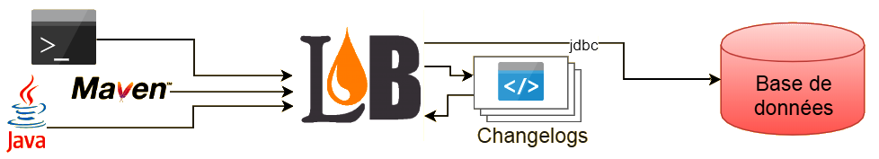

# Bonnes pratiques d'utilisation de Liquibase

> _Liquibase_ est une bibliothèque open source pour le suivi, la gestion et l'application des changements de schéma de base de données indépendante du SGBD . Elle a été lancé en 2006 pour faciliter le suivi des modifications de la base de données, en particulier dans un environnement de développement logiciel agile. [Wikipédia](https://fr.wikipedia.org/wiki/Liquibase)

## Avantages de la solution

* **Traçabilité** : historique complet des changements appliqués
* **Intégrité et cohérence** : cohérence dans l'application des changements et suivi des versions applicatives
* **Reproductibilité :** solution reproductible d'un environnement à l'autre à l'identique
* **Sécurité :** mise à niveau d'un schéma, possibilité de retour à un état précédent, ...
* **Indépendance technologique :** indépendant de la typologie du projet ou des langages utilisés (java, .Net, ...), besoin uniquement d'une JVM pour s'exécuter (API JDBC)

:bulb: Son utilisation est fortement conseillée et est même indispensable dans un contexte DevOps.

:bulb: Même s'il n'est pas utilisé sur les environnements cibles _Liquibase_ peut se révéler être un outil précieux pour le développeur permettant par exemple d'initialiser une base de données de développement ou de test (avec des jeux de données) en quelques secondes.

## Rappel des notions clefs

### Principe général

_Liquibase_ pilote via JDBC n'importe quelle base de données. On peut donc l'exécuter via un script, une commande java, un programme java, une commande Maven (via un _plugin_), ...

Nous avons besoin à minima :

* de l'exécutable java
* des informations de connexions à la base de données via JDBC (par exemple dans un fichier properties)
* des fichiers _changelog_ contenant les modifications à appliquer
* du jar liquibase

### Changelog

C'est le **catalogue** séquentiel des opérations à appliquer sur une base de données. Ces opérations sont organisées par lots qui doivent être définis comme les plus cohérents et consistants possibles.

### Changeset

C'est un **lot d'opérations** à appliquer sur la base de données. Ce lot pourra bien souvent se résumer à une seule opération (conseillé). Chaque lot peut être annulé via une procédure de retour arrière (_rollback_) parfois natif (pris en charge par l'outil : voir `auto-rollback`), parfois à la main du développeur (pour certaines instructions l'outil ne pas prédire l'action à effectuer).

### Context

Les contextes sont des **étiquettes** permettant de contrôler les changements à appliquer. Cette information peut être appliquée au niveau de l'inclusion d'un changelog ou plus finement au niveau d'un _changeset_.

:bulb: Utiliser cette notion pour créer des jeux de données pour vos tests unitaires et l'intégration continue.

## Règles fondamentales

* :warning: **Ne jamais intervenir manuellement sur le schéma de base.** Toute modification doit entraîner la création d'un nouveau _changeset_.
* :warning: **Un _changeset_ est IMMUABLE.** Si celui-ci a déjà été exécuté sur un des environnements projet il ne doit plus jamais être modifié dans le fichier _changelogs_.
* :warning: **Apporter une attention particulière aux commandes _rollback_.**

## Bonnes pratiques de conception des fichiers changelog

* Organiser vos fichiers de _changelogs_ avec un fichier principal et des fichiers par version applicative comme il est indiqué dans les bonnes pratiques de l'outil (on peut également isoler les données, de test ou d'initialisation tel que des paramètres, dans un dossier dédié, par exemple _data_).
* Favoriser le format XML pour l'écriture des fichiers _changelogs_, ce format est connu de tous (dev, ops, AD), pris en charge par de nombreux outils (par exemple un simple _browser_) et ne nécessite pas de dépendances externes (fichiers jar).
* L'attribut `logicalFilePath` d'un fichier _changelog_ doit juste contenir le nom du fichier. Celui-ci doit également **être différent pour chaque fichier**, attention aux copier-coller !
* Positionner l'attribut `objectQuotingStrategy` sur le `databaseChangeLog` de plus au niveau (ex ⇒ `db-changelog-master.xml`). La valeur `QUOTE_ONLY_RESERVED_WORDS` est conseillée.
* L'attribut `author` d'un _changeset_ doit être normalisé, utiliser par exemple le nom de l'application ou du composant.
* L'attribut `id` d'un _changeset_ doit être normalisé, utiliser par exemple le numéro de version suivi d'un numéro incrémental (l'id devant évidement être unique).
* Prévoir pour chaque _changeset_ son rollback. Se baser sur la documentation officielle car dans la majorité des cas il n'y aura rien à prévoir (vérifier dans la documentation officielle si `auto-rollback = yes`).
* Prévoir dans les _changelogs_ une compatibilité avec différents systèmes, par exemple une cible Oracle, un poste de développement avec MySQL et des tests unitaires exécutés sur une base H2 ou HSQL.
* Définir les changements de la manière la plus élémentaire possible (1 changement = 1 _changeset_) ainsi le code de rollback est plus facile à implémenter.
* Éviter l'utilisation de `includeAll` qui permet d'inclure dans le _changelog_ principal tous les _changelogs_ d'un sous-dossier. Préférer utiliser `include` en nommant les fichiers un par un pour éviter de prendre en compte des éléments non désirés ou pour pouvoir spécifier des contextes différents.
* Écrire et maintenir à la main vos fichiers changelogs (s'ils sont générés la première fois il faut les revoir : modification des attributs author ou id, contrôles et ajustement des types, etc...).
* Limiter **au strict minimum** l'usage de fichiers SQL.
* Attention à certaines instructions comme `modifyDataType`, `addNotNullConstraint`, ... qui peuvent faire perdre des données (par exemple les commentaires, nullable, ...).
* Considérer l'utilisation de _property_  conditionnées via l'attribut `dbms` pour gérer les différents SGBD. Exemple :
  * `<property name="current.date" value="sysdate" dbms="oracle"/>`
  * `<property name="current.date" value="current_timestamp" dbms="mysql, hsqldb, h2"/>`
* Penser à ne pas oublier et à gérer correctement les _tablespaces_. Utiliser par exemple des _property_ pour gérer l'externalisation de leurs noms.
* Décrire avec précisions les _changesets_ via la balise `<comment>`.

## Bonnes pratiques méthodologiques de mise en oeuvre

* Suivre les recommendations du site officiel sur la [page des _Best Practices_](http://www.liquibase.org/bestpractices.html).
* Tagger les versions. Plusieurs techniques (via la balise `tagDatabase` ou la commande `tag`) et méthodes possibles (avant ou après les mises à jour).
* Utiliser un contexte et des fichiers dédiés pour créer des jeux de tests.
* Décorréler l'exécution de _Liquibase_ du déploiement applicatif (même si c'est très pratique). Intégrer cette exécution comme une étape indépendante du processus de mise à jour de l'application. L'analyse des problèmes n'en sera que facilité.
  * La base de données est généralement un composant critique. Le mode automatisé en sous-marin (_lancement automatique au déploiement de l'application_) n'est pas forcément le plus adapté (suivi, gestion des problèmes, ...).
  * Plusieurs composants ou le même composant en _cluster_ peut vouloir mettre à jour la base en même temps. Autant éviter des _locks_ inutiles, voir des erreurs dues à des _timeout_.
  * La base de données peut avoir besoin d'une mise à jour de façon indépendante. C'est un composant en tant que tel.
* Exécuter toujours une commande `status` comme un _dry run_ avant un `update` pour contrôler les mises à jour que l'outil va appliquer.
* Utiliser un projet (voire même un dépôt GIT) dédié pour stocker les sources des _changelogs_ et packager celui-ci sous forme d'un module Maven.
* Écrire une classe de test utilisant une base de données "in memory" (H2 par exemple) permettant de valider les fichiers _changelogs_, y compris le rollback.
* Implémenter un élément (une servlet, un WebService, ...) permettant de connaître l'état de la base de données (_liquibase status_).
* Intégrer les _changelogs_ aux processus de revue et/ou d'audit.

## Annexes

### Trucs & astuces

* Pour les tests ou la validation préférer l'utilisation des bases H2 ou HSQL plutôt que Derby, cette dernière n'offrant pas de mode de compatibilité vers les SGBD phares (à positionner dans l'URL JDBC) :
  * Compatibilité vers Oracle : `sql.syntax_ora=true` pour HSQL ou `MODE=Oracle` pour H2.
  * Compatibilité vers MySQL : `sql.syntax_mys=true` pour HSQL ou `MODE=MySQL` pour H2.
* Utiliser plutôt `liquibase status --verbose` qui affiche le nom des _changesets_ à exécuter plutôt que `liquibase status` qui n'affiche uniquement le nombre.
* Pour faire un _rollback_ complet utiliser par exemple `liquibase rollbackToDate 1970-01-01T00:00:00`.

### Versioning Liquibase

| Version Liquibase | Version minimale Java | Dépendances obligatoires | Dépendances optionnelles |
|-------------------|-----------------------|--------------------------|--------------------------|
| `3.5.3` | Java 6 | | snakeyaml (1.17), spring (2.0.6), servlet-api (2.4) |
| `3.5.4` | Java 6 | | snakeyaml (1.17), spring (2.0.6), servlet-api (2.4) |
| `3.5.5` | Java 6 | | snakeyaml (1.17), spring (2.0.6), servlet-api (2.4) |
| `3.6.0` | Java 7 | slf4j-api (1.7.25), logback-classic (1.2.3) | snakeyaml (1.18), spring-core, spring-beans, spring-context (4.3.8.RELEASE), servlet-api (2.4) |
| `3.6.1` | Java 7 | slf4j-api (1.7.25), logback-classic (1.2.3) | snakeyaml (1.18), spring-core, spring-beans, spring-context (4.3.8.RELEASE), servlet-api (2.4) |
| `3.6.2` | Java 7 | slf4j-api (1.7.25), logback-classic (1.2.3) | snakeyaml (1.18), spring-core, spring-beans, spring-context (4.3.8.RELEASE), servlet-api (2.4) |
| `3.6.3` | Java 7 | slf4j-api (1.7.25), logback-classic (1.2.3) | snakeyaml (1.18), spring-core, spring-beans, spring-context (4.3.8.RELEASE), servlet-api (2.4) |
| `3.7.0` | Java 8 | slf4j-api (1.7.25), logback-classic (1.2.3) | snakeyaml (1.23), spring-core, spring-beans, spring-context (4.3.8.RELEASE), servlet-api (2.4) |

> :warning: Liquibase 3.6.x is binary api-incompatible with 3.5.x
